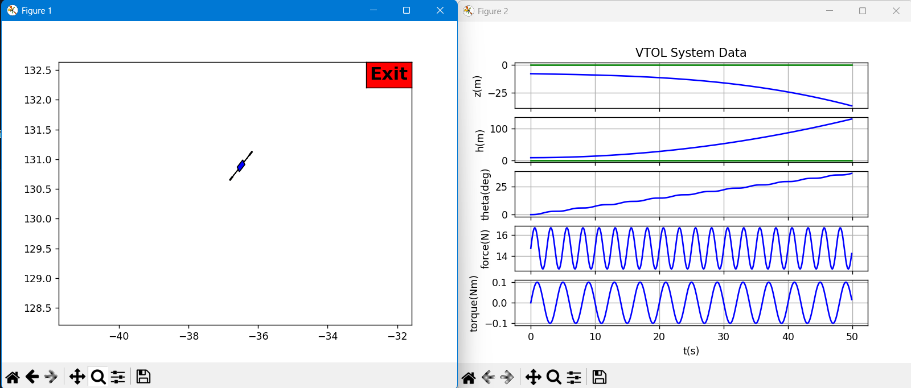

# F.5 — Planar VTOL: Transfer-function model (about hover)

Use small-angle hover linearization with perturbations $\tilde h,\tilde z,\tilde\theta,\tilde F,\tilde\tau$. Let $F_e=mg$.

**Vertical (longitudinal) channel:**
$$
m\,\ddot{\tilde h}=\tilde F
\quad\Rightarrow\quad
\frac{\tilde H(s)}{\tilde F(s)}=\frac{1}{m\,s^2}.
$$

**Pitch (attitude):**
$$
J\,\ddot{\tilde\theta}=\tilde\tau
\quad\Rightarrow\quad
\frac{\tilde\Theta(s)}{\tilde\tau(s)}=\frac{1}{J\,s^2}.
$$

**Lateral (side translation):**
$$
m\,\ddot{\tilde z}+\mu\,\dot{\tilde z}=-F_e\,\tilde\theta,
\qquad F_e=m g,
$$
so
$$
\frac{\tilde Z(s)}{\tilde\Theta(s)}=-\frac{F_e/m}{s^2+(\mu/m)s},
\qquad
\frac{\tilde Z(s)}{\tilde\tau(s)}=
\left(-\frac{F_e}{m}\right)\frac{1}{J\,s^2}\cdot\frac{1}{s^2+(\mu/m)s}.
$$

**Block-diagram sketch (text).**
- Vertical: single block $1/(m s^2)$ from $\tilde F$ to $\tilde h$.
- Lateral cascade: $\tilde\tau \rightarrow \tilde\theta$ via $1/(J s^2)$, then $\tilde\theta \rightarrow \tilde z$ via $-\tfrac{F_e}{m}\cdot \tfrac{1}{s^2+(\mu/m)s}$.

---

# F.6 — Planar VTOL: Linear state-space model

Choose
$$
x=\begin{bmatrix}\tilde z&\tilde h&\tilde\theta&\dot{\tilde z}&\dot{\tilde h}&\dot{\tilde\theta}\end{bmatrix}^\top,\quad
u=\begin{bmatrix}\tilde F\\ \tilde\tau\end{bmatrix},\quad
y=\begin{bmatrix}\tilde z\\ \tilde h\\ \tilde\theta\end{bmatrix}.
$$

Linearized dynamics about hover (with lateral drag $\mu$):
$$
\ddot{\tilde h}=\tfrac{1}{m}\tilde F,\qquad
\ddot{\tilde\theta}=\tfrac{1}{J}\tilde\tau,\qquad
\ddot{\tilde z}= -\tfrac{\mu}{m}\dot{\tilde z}-\tfrac{F_e}{m}\tilde\theta,\quad F_e=mg.
$$

State-space form $\dot x = A x + B u,\; y=Cx+Du$:
$$
A=\begin{bmatrix}
0&0&0&1&0&0\\
0&0&0&0&1&0\\
0&0&0&0&0&1\\
0&0&-\tfrac{F_e}{m}&-\tfrac{\mu}{m}&0&0\\
0&0&0&0&0&0\\
0&0&0&0&0&0
\end{bmatrix},\quad
B=\begin{bmatrix}
0&0\\
0&0\\
0&0\\
0&0\\
\tfrac{1}{m}&0\\
0&\tfrac{1}{J}
\end{bmatrix},
$$
$$
C=\begin{bmatrix}
1&0&0&0&0&0\\
0&1&0&0&0&0\\
0&0&1&0&0&0
\end{bmatrix},\qquad
D=\begin{bmatrix}
0&0\\
0&0\\
0&0
\end{bmatrix}.
$$


# HW3 Testing — F Section (VTOL)

This mirrors your D-section test notes, but for **F.5 (transfer functions)** and **F.6 (linear state space)** using the hover-linearized VTOL.

---

## 1) VTOL dynamics unit tests (nonlinear `Dynamics.f(x,u)`)

**Run**
```bash
C:/Users/consa/Downloads/Programming/Robotics_Controls/.venv/Scripts/python.exe ^
  c:/Users/consa/Downloads/Programming/Robotics_Controls/_F_planar_vtol/python/testDynamics.py
```

**Expect**
- The script executes without errors and reports each derivative check as **PASS** (exact text may differ from the mass test).
- This validates your **nonlinear** `Dynamics.f(x,u)` ODE (rotor inputs `[f_r,f_l]`) still behaves.

> Tip: If you previously saw `AttributeError: VTOLParam has no attribute 'unmixing'`, make sure `VTOLParam.py` defines `mixing` (used to map `[F; τ] → [f_r; f_l]`). The linear demo uses `P.mixing`.

---

## 2) Linear hover model + animation (`runVTOLAnimation.py`)


**Run**
```bash
C:/Users/consa/Downloads/Programming/Robotics_Controls/.venv/Scripts/python.exe ^
  c:/Users/consa/Downloads/Programming/Robotics_Controls/_F_planar_vtol/python/runVTOLAnimation.py
```

**What the program does**
- Simulates the **F.6 linear state-space