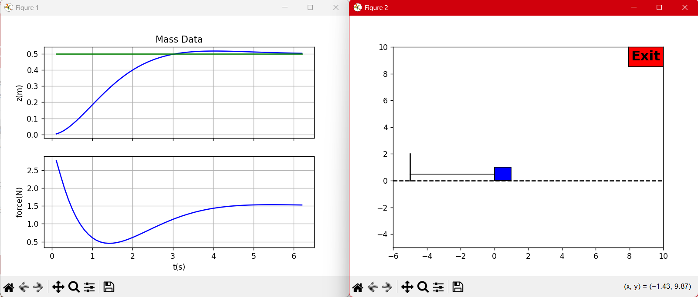

## HW6 — D.9(a), D.10, F.9, F.10

Concise summary with run commands aligned to the provided solutions.

### Run Commands
- Mass PID (D.10): `python _D_mass/python/hwD10_massSim.py`
- VTOL PID (F.10): `python _F_planar_vtol/python/hw10_VTOLSim.py`

Optional (context): D.8 and F.8 references exist but are not required.

### Results Placeholders
- D.9(a) system type/SSE summary: 
- D.10 mass PID step response: 
```bash
(.venv) C:\Users\consa\Downloads\Programming\Robotics_Controls>C:/Users/consa/Downloads/Programming/Robotics_Controls/.venv/Scripts/python.exe c:/Users/consa/Downloads/Programming/Robotics_Controls/_D_mass/python/hwD10_massSim.py
kp:  3.0500000000000007
ki:  1.5
kd:  7.277
Press key to close
```

- F.9 VTOL type summaries: 
- F.10 VTOL step in h and z: 
```bash
(.venv) C:\Users\consa\Downloads\Programming\Robotics_Controls>C:/Users/consa/Downloads/Programming/Robotics_Controls/.venv/Scripts/python.exe c:/Users/consa/Downloads/Programming/Robotics_Controls/_F_planar_vtol/python/hw10_VTOLSim.py
kp_z:  -0.10318726993480598
kd_z:  -0.1880684580546151
ki_z:  0.0
kp_h:  4.217779658585194
kd_h:  4.779045600456102
kp_th:  4.9803542208573965
kd_th:  0.9405161741697609
Press key to close
```

---

### D.9(a) — System Type & Integrators (Mass–Spring–Damper)

Unity feedback error transfer and final value theorem:
E(s) = 1/(1 + P(s)C(s)) R(s),  e_inf = lim_{s->0} s E(s).

- PD: C_PD(s) = kP + kD s → type 0.
  - Step: finite SSE; Ramp: ∞; Parabola: ∞.
- PID: C_PID(s) = kP + kI/s + kD s → type 1.
  - Step: 0 SSE; Ramp: finite; Parabola: ∞.

Takeaway: one integrator guarantees zero SSE to steps and improves robustness.

---

### D.10 — PID with Dirty Derivative

Continuous form (sigma = 0.05): C(s) = kP + kI(1/s) + kD s/(sigma s + 1).
Implementation uses trapezoidal integral and dirty derivative per solution.

Files used:
- Controller: `_D_mass/python/ctrlPID.py`
- Simulation: `_D_mass/python/hwD10_massSim.py`

---

### F.9 — VTOL Types & Integrators

- Altitude (h): PD → type 0; add I → type 1 (step 0 SSE).
- Attitude (theta): inner PD loop (type 0), usually no I here.
- Lateral position (z): outer PD loop; optional I if needed.

---

### F.10 — VTOL PID (Nested)

Controller structure per solution: altitude PID, z-loop PID producing theta_r, inner theta PD, with mixing to motor forces.

Files used:
- Controller: `_F_planar_vtol/python/ctrlPID.py`
- Simulation: `_F_planar_vtol/python/hw10_VTOLSim.py`
