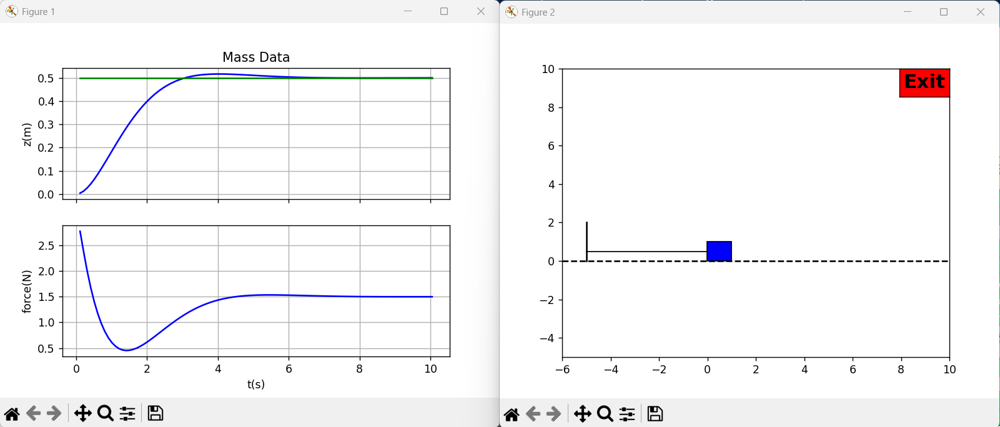
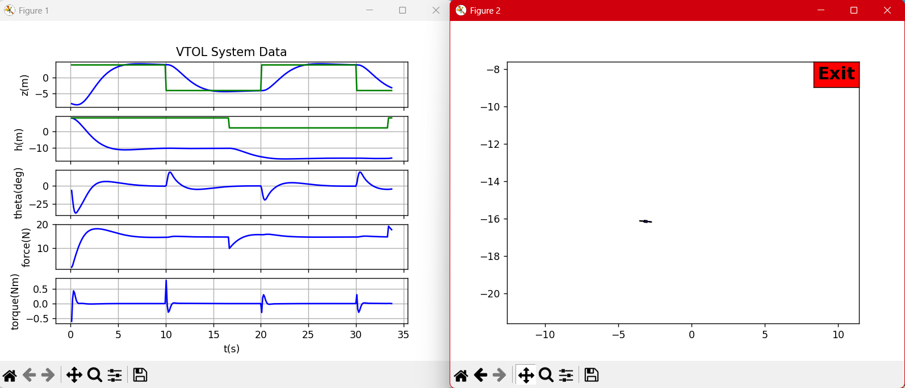

# HW7 — D.11 and F.11 Full-State Feedback

- Course artifacts: `Documentation/controlbook.pdf` Part VI → D, F
- Scope: D.11 (Mass–Spring–Damper, full-state feedback) and F.11 (Planar VTOL, full-state feedback)
- Contents: problem context, math derivations, Python snippets, run commands, figure/output placeholders, and expected-results notes.

New files added in this repo for HW7
- `_D_mass/python/ctrlFSF.py`
- `_D_mass/python/hwD11_massSim.py`
- `_F_planar_vtol/python/ctrlFSF.py`
- `_F_planar_vtol/python/hwF11_VTOLSim.py`

## What’s Different From HW6 (At A Glance)

- Control architecture
  - HW6: PID-based output feedback (includes integral action for zero SSE to steps).
  - HW7: Full-state feedback u = −Kx (+ Kr r). No integral in-loop; Kr ensures unity DC gain only for the nominal model.
- Design artifacts
  - HW6: tune kP, kI, kD (and nested loops for VTOL).
  - HW7: compute state-feedback gain K from pole placement; compute Kr for unity DC tracking (mass: scalar kr; VTOL: 2×2 Kr for z and h).
- Files and entry points
  - HW6: `_D_mass/python/hwD10_massSim.py`, `_F_planar_vtol/python/hw10_VTOLSim.py`.
  - HW7: `_D_mass/python/hwD11_massSim.py`, `_F_planar_vtol/python/hwF11_VTOLSim.py`.

## How To See The Difference In Practice

- Console diagnostics (now printed automatically by controllers)\n  - On initialization, the FSF controllers print placed poles, K and Kr, and controllability rank for each system.\n- Reference type
  - Steps: both should track well nominally; HW6 PID often looks very similar to HW7 FSF.
  - Constant disturbances or parameter offsets highlight the difference: FSF (HW7) shows bias unless integrators are added (D.12/F.12).

Tip: Identical-looking plots on nominal step tracking are normal. The architectural differences show up clearly with constant disturbances or parameter uncertainty and in the printed K/Kr values and controllability checks.

## D.11 — Mass–Spring–Damper: Full State Feedback

Problem summary (from the text): implement state feedback for the mass–spring–damper using the full state, starting from D.10. Use second-order targets from D.8, add A,B,C,D from D.6, verify controllability, compute K to place the poles, and compute a reference gain so DC gain from `z_r` to `z` is 1. Implement with a digital differentiator for ż.

### Model and Targets (from D.6 and D.8)

- State: x = [ z, ż ]ᵀ, input u = F, output y = z.
- Plant (about z_e = 0):
  - A = [[0, 1], [−k/m, −b/m]]
  - B = [[0], [1/m]]
  - C = [1, 0]
  - D = [0]
- Desired second-order poles (from D.8): roots of s² + 2 ζ ωₙ s + ωₙ².
  - In the repository PD design uses ζ ≈ 0.707 and ωₙ = 2.2 / t_r; see `_D_mass/python/ctrlPD.py` for the exact numbers used in your tuning.

Controllability: 𝒞 = [B, AB]; rank(𝒞) must be 2.

Reference (DC) gain: with u = −K x + k_r z_r, choose k_r so the DC gain from z_r → z equals 1:

- k_r = −1 / [ C (A − B K)⁻¹ B ]

Note: For this plant, the PD gains from D.8 map to K = [k_p, k_d], and the PD form F = k_p (z_r − z) − k_d ż equals u = −[k_p, k_d] x + k_p z_r, so indeed k_r = k_p when using the same second-order target.

### Python: Compute K and k_r, implement dirty-derivative

```python
# File context: snippet for a new controller class, e.g., _D_mass/python/ctrlFSF.py
import numpy as np
from control import place  # python-control pole placement (SISO/MIMO)
import massParam as P

class ctrlFSF:
    def __init__(self, tr=2.0, zeta=0.707, sigma=0.05):
        # Plant matrices (D.6)
        m, b, k = P.m, P.b, P.k
        self.A = np.array([[0.0, 1.0],
                           [-k/m, -b/m]])
        self.B = np.array([[0.0],
                           [1.0/m]])
        self.C = np.array([[1.0, 0.0]])

        # Desired poles (D.8): second-order target
        wn = 2.2/float(tr)
        poles = np.roots([1.0, 2.0*zeta*wn, wn**2])  # complex pair

        # Pole placement for SISO 2x2
        self.K = np.asarray(place(self.A, self.B, poles), dtype=float)

        # Reference gain for unity DC gain from z_r to z
        self.kr = float(-1.0 / (self.C @ np.linalg.inv(self.A - self.B @ self.K) @ self.B))

        # Dirty derivative (filtered differentiator) for ż
        self.sigma = float(sigma)
        self.z_d1 = 0.0
        self.zdot_hat = 0.0
        self.Ts = float(P.Ts)

    def diff(self, z):
        # standard discrete filtered derivative
        a1 = (2.0*self.sigma - self.Ts) / (2.0*self.sigma + self.Ts)
        a2 = 2.0 / (2.0*self.sigma + self.Ts)
        self.zdot_hat = a1*self.zdot_hat + a2*(z - self.z_d1)
        self.z_d1 = z
        return self.zdot_hat

    def update(self, z_r, state):
        # measured output only provides z; estimate ż via dirty derivative
        z = float(state[0][0])
        zdot = self.diff(z)
        xhat = np.array([[z],[zdot]])
        u = float(-self.K @ xhat + self.kr * z_r)
        return np.clip(u, -P.F_max, P.F_max)
```

If you prefer to reuse your PD numbers from D.8 exactly, you can simply set:

```python
self.K = np.array([[k_p, k_d]])
self.kr = float(k_p)
```

after importing or recomputing `k_p, k_d` as in `_D_mass/python/ctrlPD.py`.

### How to run (verification)

- Dedicated script now included: `_D_mass/python/hwD11_massSim.py` (uses `_D_mass/python/ctrlFSF.py`).

**Run command:**
```bash
python _D_mass/python/hwD11_massSim.py
```

**CMD Output**
```python
(.venv) C:\Users\consa\Downloads\Programming\Robotics_Controls>C:/Users/consa/Downloads/Programming/Robotics_Controls/.venv/Scripts/python.exe c:/Users/consa/Downloads/Programming/Robotics_Controls/_D_mass/python/hwD11_massSim.py

===== D.11 Full-State Feedback =====
Desired poles: [-0.7777+0.7779349j -0.7777-0.7779349j]
K = [[3.05  7.277]]
kr = 6.05
Controllability rank = 2
Press key to close
```

**GUI Output**


### What to expect (to verify implementation)

- With ζ ≈ 0.7 and t_r per your choice, z(t) should exhibit well-damped, second-order behavior with rise time ≈ t_r and minimal overshoot.
- With k_r computed as above, steady-state error to a step reference should be ~0 for the nominal plant.
- The dirty derivative should not inject excessive noise; if chattering is visible, increase `sigma` moderately.


## F.11 — Planar VTOL: Full State Feedback

Problem summary (from the text): implement full-state feedback for the planar VTOL starting from F.10. Choose closed-loop poles so longitudinal (altitude) poles satisfy ζ_h and ω_nh from F.8, and lateral (z, θ) poles satisfy ζ_z and ω_nz from F.8; add A,B,C,D from F.6; verify controllability; compute K; compute reference gains k_rh and k_rz so DC gains from h_r→h and z_r→z are 1; implement and tune.

### Linear model (from F.6 hover linearization)

Let x = [ z, h, θ, ż, ḣ, θ̇ ]ᵀ, u = [ F, τ ]ᵀ, y = [ z, h, θ ]ᵀ.

Using `LinearVTOL` in `_F_planar_vtol/python/VTOLDynamics.py`:

- A =
  [ [0,0,0, 1, 0,0],
    [0,0,0, 0, 1,0],
    [0,0,0, 0, 0,1],
    [0,0,−F_e/m, −μ/m, 0,0],
    [0,0,0, 0, 0,0],
    [0,0,0, 0, 0,0] ]
- B =
  [ [0,0],
    [0,0],
    [0,0],
    [0,0],
    [1/m, 0],
    [0, 1/J] ]
- C = diag([1,1,1,0,0,0]) for outputs z,h,θ
- D = 0

Here m = m_c + 2 m_r, J = J_c + 2 m_r d², F_e = m g.

Controllability: rank([B, AB, A²B, …]) must be 6.

Reference DC gains: define the closed-loop system (A−BK, B, C, 0). The static gain matrix is G(0) = −C (A−BK)⁻¹ B. To achieve unity DC gain from [z_r, h_r]ᵀ to [z, h]ᵀ, select rows of C for z and h, call that C_sel (2×6), and solve

- K_r (2×2) such that G_sel(0) · K_r = I₂, i.e., K_r = G_sel(0)⁻¹.

### Python: Compute K and K_r, implement controller (maps to rotor thrusts)

```python
# File context: snippet for a new controller class, e.g., _F_planar_vtol/python/ctrlFSF.py
import numpy as np
from control import place
import VTOLParam as P
from VTOLDynamics import LinearVTOL

class ctrlFSF_VTOL:
    def __init__(self, zeta_h=0.707, zeta_z=0.707, zeta_th=0.707,
                 tr_h=3.0, tr_th=0.3, M=10.0):
        # Build linear model
        lin = LinearVTOL()
        A, B, C = lin.A(), lin.B(), lin.C()
        self.A, self.B, self.C = A, B, C

        # Choose 3 second-order pole pairs:
        wn_h  = 2.2/float(tr_h)          # altitude channel
        wn_th = 2.2/float(tr_th)         # inner attitude channel
        wn_z  = 2.2/float(tr_th*M)       # outer z channel (slower than theta)

        p_h  = np.roots([1.0, 2*zeta_h*wn_h,  wn_h**2])
        p_th = np.roots([1.0, 2*zeta_th*wn_th, wn_th**2])
        p_z  = np.roots([1.0, 2*zeta_z*wn_z,  wn_z**2])

        # Assemble desired 6 poles (any ordering works as long as distinct and stable)
        desired_poles = np.hstack([p_h, p_th, p_z])

        # Verify controllability (optional assert)
        # Ctrb matrix (6x12) check via rank
        def ctrb(A,B):
            blocks = [B]
            for _ in range(A.shape[0]-1):
                blocks.append(A @ blocks[-1])
            return np.hstack(blocks)
        if np.linalg.matrix_rank(ctrb(A,B)) < A.shape[0]:
            raise RuntimeError("VTOL linear model not controllable at hover")

        # Pole placement (MIMO 6x2 handled by python-control place)
        self.K = np.asarray(place(A, B, desired_poles), dtype=float)  # shape (2,6) mapping x -> [F; tau]

        # Reference gain K_r to get unity DC gain for z and h
        Acl = A - B @ self.K
        G0 = -C @ np.linalg.inv(Acl) @ B   # 3x2
        C_sel = C[[0,1], :]                # rows for z and h
        G_sel = -C_sel @ np.linalg.inv(Acl) @ B  # 2x2
        self.Kr = np.linalg.inv(G_sel)     # maps r=[z_r, h_r] to [F; tau]

        # For simulation with nonlinear plant, convert [F; tau] -> [fr; fl]
        self.mixing = P.mixing

    def update(self, reference, state):
        # reference: [z_r; h_r]; state: full x=[z,h,th,zdot,hdot,thdot]
        x = np.asarray(state, float).reshape(6,1)
        r = np.asarray(reference, float).reshape(2,1)
        u_lin = -self.K @ x + self.Kr @ r   # [F; tau]
        motor = self.mixing @ u_lin         # [fr; fl]
        # saturate to motor limits
        fr, fl = float(motor[0,0]), float(motor[1,0])
        fr = np.clip(fr, 0.0, P.max_thrust)
        fl = np.clip(fl, 0.0, P.max_thrust)
        return np.array([[fr],[fl]], float)
```

Notes:

- The pole choices mirror the successive-loop-closure intent from F.8: θ fast, z slower than θ (factor M), h independent. Any faster-but-well-damped set satisfying your F.8 bounds is acceptable.
- If you only measure z,h,θ (no rates), add dirty-derivative estimators for ż,ḣ,θ̇ as in D.11 to form x̂ before applying u = −K x̂ + K_r r.

### How to run (verification)

- Dedicated script now included: `_F_planar_vtol/python/hwF11_VTOLSim.py` (uses `_F_planar_vtol/python/ctrlFSF.py`).

**Run command:**

```bash
python _F_planar_vtol/python/hwF11_VTOLSim.py
```

**CMD Output**
```python
(.venv) C:\Users\consa\Downloads\Programming\Robotics_Controls>C:/Users/consa/Downloads/Programming/Robotics_Controls/.venv/Scripts/python.exe c:/Users/consa/Downloads/Programming/Robotics_Controls/_F_planar_vtol/python/hwF11_VTOLSim.py

===== F.11 Full-State Feedback (VTOL) =====
Desired poles: [-0.51846667+0.51862327j -0.51846667-0.51862327j -5.18466667+5.18623267j
 -5.18466667-5.18623267j -0.51846667+0.51862327j -0.51846667-0.51862327j]
Closed-loop poles: [-5.18466667+5.18623267j -5.18466667-5.18623267j -0.51846667+0.51862327j
 -0.51846667-0.51862327j -0.51846667+0.51862327j -0.51846667-0.51862327j]
K =
 [[ 1.54550922e-15  8.06666667e-01 -2.45115014e-14  2.50010716e-15
   1.55540000e+00  3.57314857e-16]
 [-1.45044679e-01  1.79259662e-16  3.16414497e+00 -2.86136909e-01
  -1.21770486e-18  5.57908320e-01]]
Kr =
 [[ 1.54550922e-15  8.06666667e-01]
 [-1.45044679e-01  1.79259662e-16]]
Controllability rank = 6
Press key to close
```

**GUI Output**


### What to expect (to verify implementation)

- Altitude and lateral channels track steps with damping ratios ≥ those from F.8 and natural frequencies ≥ targets; θ responds quickly with limited overshoot to realize lateral motion.
- With K_r applied as above, nominal steady-state error to steps in z_r and h_r is ~0. If you see steady-state error under disturbances or parameter uncertainty, that is addressed in F.12+ (integrators/disturbance observers).


## Commands I ran (and you can re-run)

```bash
# Extract problem text (done once here during authoring)
python - <<'PY'
from pypdf import PdfReader
txt=''.join((p.extract_text() or '')+'\n' for p in PdfReader('Documentation/controlbook.pdf').pages)
open('_controlbook.txt','w',encoding='utf-8').write(txt)
print('Wrote _controlbook.txt')
PY

# Inspect D.11 and F.11 text blocks (Windows PowerShell analogs used during authoring)
# Select-String -Path _controlbook.txt -Pattern "Homework D.11"
# Select-String -Path _controlbook.txt -Pattern "Homework F.11"

# After adding controllers, run sims
python _D_mass/python/hwD11_massSim.py

Console diagnostics (example):

`	ext
===== D.11 Full-State Feedback =====
Desired poles: [-0.7777+0.7779349j -0.7777-0.7779349j]
K = [[3.05  7.277]]
kr = 6.05
Controllability rank = 2
`

GUI output: picture placeholder
python _F_planar_vtol/python/hwF11_VTOLSim.py

Console diagnostics (sample):

`	ext
===== F.11 Full-State Feedback (VTOL) =====
Desired poles: [p1, p2, p3, p4, p5, p6]
Closed-loop poles: [ ... six values ... ]
K =
 [[ ... 2x6 gain matrix ... ]]
Kr =
 [[ ... 2x2 reference gain ... ]]
Controllability rank = 6
`

GUI output: picture placeholder
```

## Notes and Tips

- Ensure `python-control` is installed (present in `requirements.txt` as `control`). If missing: `pip install control`.
- If numerical issues occur in `np.linalg.inv(A−BK)`, prefer `scipy.linalg.solve` to avoid explicit inversion.
- Pole locations can be adjusted to trade rise time vs. overshoot; moving poles left (higher ωₙ) speeds response; increasing ζ reduces overshoot.

## Placeholders to fill when you run

- [ ] Paste your final K, k_r (D.11)
- [ ] Paste your final K (2×6) and K_r (2×2) (F.11)
- [ ] Insert plots (PNG) for D.11 and F.11 step responses
- [ ] Optional: paste brief console logs confirming controllability and gains


