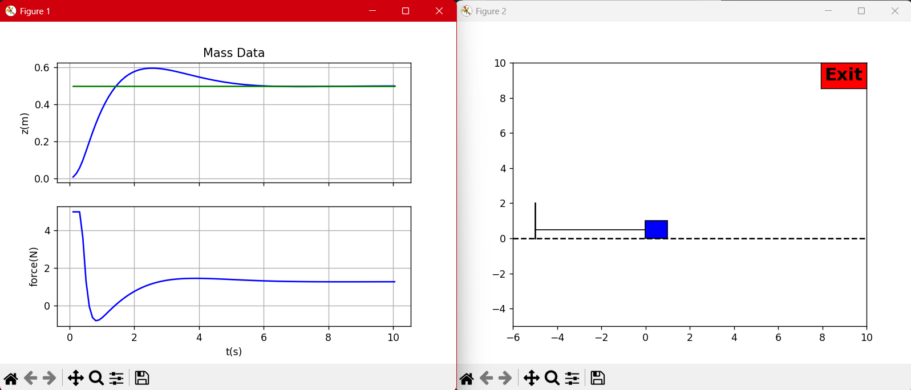
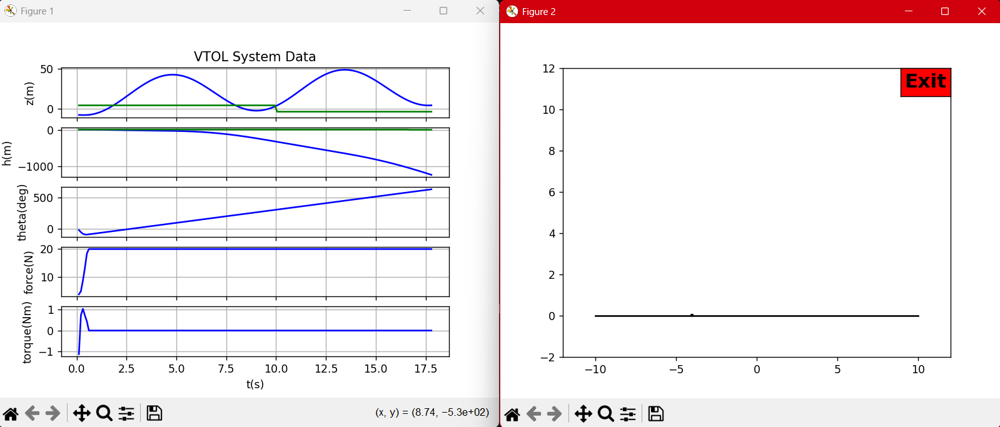

# HW8 – D.12 and F.12 FSF + Integrators

- Course artifacts: `Documentation/controlbook.pdf` Part VI → Chapters D & F
- Scope: D.12 (Mass–Spring–Damper, FSF + integrator) and F.12 (Planar VTOL, FSF + dual integrators)
- Contents: requirements recap, augmented-state math, Python highlights, run commands, and result expectations.

New files added in this repo for HW8
- `_D_mass/python/ctrlFSFInt.py`
- `_D_mass/python/hwD12_massSim.py`
- `_F_planar_vtol/python/ctrlFSFInt.py`
- `_F_planar_vtol/python/hwF12_VTOLSim.py`

## What’s Different From HW7 (At A Glance)

- Loop architecture  
  - HW7: pure full-state feedback with static feedforward (no integral loop).  
  - HW8: augment plant with error integrators (z for mass, z & h for VTOL) plus anti-windup.
- Disturbance handling  
  - HW7: nominal parameters, no constant disturbances → steady-state bias under mismatch.  
  - HW8: ±20 % param variation and constant disturbances (0.25 N for mass input, 0.1 N lateral wind in VTOL) must be rejected.
- Controllers / entry points  
  - HW7 sims: `_D_mass/python/hwD11_massSim.py`, `_F_planar_vtol/python/hwF11_VTOLSim.py`.  
  - HW8 sims: `_D_mass/python/hwD12_massSim.py`, `_F_planar_vtol/python/hwF12_VTOLSim.py`.

## How To See The Difference In Practice

- Console prints now show integral poles `p_int_*`, K/ki (mass) or Kx/Ki (VTOL) matrices, and augmented controllability ranks.
- Run HW8 sims with the same step references as HW7; you should see the HW7 cases settle with offset under disturbance while HW8 drives the error to ~0 despite input offsets.
- Force/motor plots clearly illustrate anti-windup (flat tops without integrator runaway).

## D.12 – Mass–Spring–Damper: FSF With Integrator

### Requirements Recap

- Add an integrator with anti-windup to the full-state loop from D.11.  
- Inject a constant plant input disturbance of 0.25 N.  
- Randomize plant parameters up to ±20 % each run (existing `massDynamics(alpha)` knob).  
- Preserve the dirty-derivative estimate of `ż` (still only position is measured).

### Augmented-State Design

- Base plant (D.6): `x = [z, ż]^T`, `u = F`, `y = z`.  
- Augment with integral state `ξ = ∫ (z_r - z) dt`, giving
  ```
  ẋ = A x + B u
  ξ̇ = z_r - C x
  u  = -K x - k_i ξ + k_r z_r
  ```
- Desired poles = D.11 complex pair + one real integrator pole `p_int` (tunable; default –3 rad/s).  
- When `python-control` is unavailable the code falls back to an Ackermann-style SISO pole-placement helper.  
- Anti-windup strategy: trap the trapezoidal integral update whenever the commanded force exceeds ±`P.F_max`, thereby freezing `ξ` during saturation.

### Python Highlights (`_D_mass/python/ctrlFSFInt.py`)

```python
class ctrlFSFInt:
    def update(self, z_r, y_meas):
        z = float(np.asarray(y_meas).flatten()[0])
        zdot_hat = self._dirty_derivative(z)
        error = z_r - z
        integ_inc = 0.5 * self.Ts * (error + self._error_prev)
        self._integrator += integ_inc

        xhat = np.array([[z], [zdot_hat]])
        u_unsat = float(-self.K @ xhat - self.ki * self._integrator + self.kr * z_r)
        u_sat = np.clip(u_unsat, -P.F_max, P.F_max)

        if abs(u_unsat - u_sat) > 1e-9:
            self._integrator -= integ_inc  # anti-windup freeze
            u_sat = np.clip(float(-self.K @ xhat - self.ki * self._integrator + self.kr * z_r),
                            -P.F_max, P.F_max)
        self._error_prev = error
        return u_sat
```

### Run + Expected Results

```powershell
C:/Users/consa/Downloads/Programming/Robotics_Controls/.venv/Scripts/python.exe `
  c:/Users/consa/Downloads/Programming/Robotics_Controls/_D_mass/python/hwD12_massSim.py
```

- Constant input offset of +0.25 N gets added inside the sim loop (`mass.update(u + disturbance)`), so the HW7 controller would have settled with noticeable bias; HW8 converges to the reference.  
- Mass animation/plots show minor overshoot while the integrator overcomes the disturbance, then zero steady-state error even when the randomly perturbed plant deviates by ±20 %.

### Output: 
```python
(.venv) C:\Users\consa\Downloads\Programming\Robotics_Controls>C:/Users/consa/Downloads/Programming/Robotics_Controls/.venv/Scripts/python.exe c:/Users/consa/Downloads/Programming/Robotics_Controls/_D_mass/python/hwD12_massSim.py

===== D.12 FSF + Integrator =====
Desired poles: [-0.7777+0.7779349j -0.7777-0.7779349j -3.    +0.j       ]
K = [[26.381 22.277]]
ki = -18.149999999999995
kr = 29.380999999999986
Controllability rank = 2
Press key to close

```



## F.12 – Planar VTOL: FSF With Dual Integrators

### Requirements Recap

- Start from the hover-linearized FSF (F.11) and add integrators on both altitude and lateral-position loops, each with anti-windup.  
- Allow ±20 % parameter variation in the nonlinear plant.  
- Apply a constant lateral wind force of 0.1 N (disturbance injected inside `VTOLDynamics.Dynamics`).  
- Keep the two-channel reference (`z_r`, `h_r`) and motor saturation (0…`max_thrust` N per rotor).

### Augmented-State Design

- Augmented state = `[x; ξ_z; ξ_h]` where `x ∈ ℝ^6` are the hover states and `ξ` integrates `[z_r - z, h_r - h]^T`.  
- Matrices:
  ```
  A_aug = [[A, 0],
           [-C_sel, 0]],   B_aug = [[B],
                                    [0]]
  ```
  with `C_sel` extracting z/h rows from the linear-output matrix.  
- Desired poles = altitude, pitch, lateral pairs from HW7 plus two real integral poles (`p_int_h`, `p_int_z`). Defaults place the integrators slower than the fastest dynamics to avoid severe coupling.  
- Control law mirrors the SISO case but with matrix gains:
  `u = -Kx x - Ki ξ + Kr r`, `ξ̇ = r - C_sel x`.  
- Anti-windup again freezes the integrator increments when either rotor command saturates.

### Python Highlights (`_F_planar_vtol/python/ctrlFSFInt.py`)

```python
motor_unsat = self.mixing @ u_lin              # [fr; fl] before saturation
motor_sat = self._saturate_motors(motor_unsat)
if self.use_aw and np.any(np.abs(motor_unsat - motor_sat) > 1e-9):
    self.integrator -= integ_inc              # undo integral growth on saturation
    u_lin = -self.Kx @ x - self.Ki @ self.integrator + self.Kr @ r
    motor_sat = self._saturate_motors(self.mixing @ u_lin)
```

- `hwF12_VTOLSim.py` instantiates `Dynamics(alpha=0.2)` for uncertainty and directly sets `VTOL.F_wind = 0.1` to inject the constant lateral force.  
- The sim references remain slow square waves so you can visually compare with HW7.

### Run + Expected Results

```powershell
C:/Users/consa/Downloads/Programming/Robotics_Controls/.venv/Scripts/python.exe `
  c:/Users/consa/Downloads/Programming/Robotics_Controls/_F_planar_vtol/python/hwF12_VTOLSim.py
```

- Plots show the lateral channel rejecting the 0.1 N wind after a brief transient (z settles near the square reference instead of drifting).  
- Altitude tracking stays accurate despite the uncertainty and the shared motor saturation—watch the torque plot flatten without integrator windup.  
- Console dump from the controller lists the 8 placed poles, `Kx`, `Ki`, and `Kr`; use it to sanity-check tuning or to move the integrator poles if the response is sluggish/aggressive.

(.venv) C:\Users\consa\Downloads\Programming\Robotics_Controls>C:/Users/consa/Downloads/Programming/Robotics_Controls/.venv/Scripts/python.exe c:/Users/consa/Downloads/Programming/Robotics_Controls/_F_planar_vtol/python/hwF12_VTOLSim.py

===== F.12 FSF + Integrators =====
Desired poles: [-0.51846667+0.51862327j -0.51846667-0.51862327j -5.18466667+5.18623267j
 -5.18466667-5.18623267j -0.51846667+0.51862327j -0.51846667-0.51862327j
 -1.5       +0.j         -1.        +0.j        ]
Closed-loop poles: [-5.18466667+5.18623267j -5.18466667-5.18623267j -1.        +0.j
 -1.5       +0.j         -0.51846667+0.51862327j -0.51846667-0.51862327j
 -0.51846667+0.51862327j -0.51846667-0.51862327j]
Kx =
 [[-4.90073655e-02  3.13979474e+00  1.97497248e-01 -5.62865453e-02
   3.80542707e+00 -1.90904889e-02]
 [-4.52708316e-01  1.81690500e-03  3.72202136e+00 -6.08701270e-01
   1.75219076e-03  6.07107432e-01]]
Ki =
 [[ 1.92747821e-02 -1.21001456e+00]
 [ 1.45057944e-01 -9.42289250e-04]]
Kr =
 [[-4.90073655e-02  3.13979474e+00]
 [-4.52708316e-01  1.81690500e-03]]
Controllability rank (augmented) = 8
```


