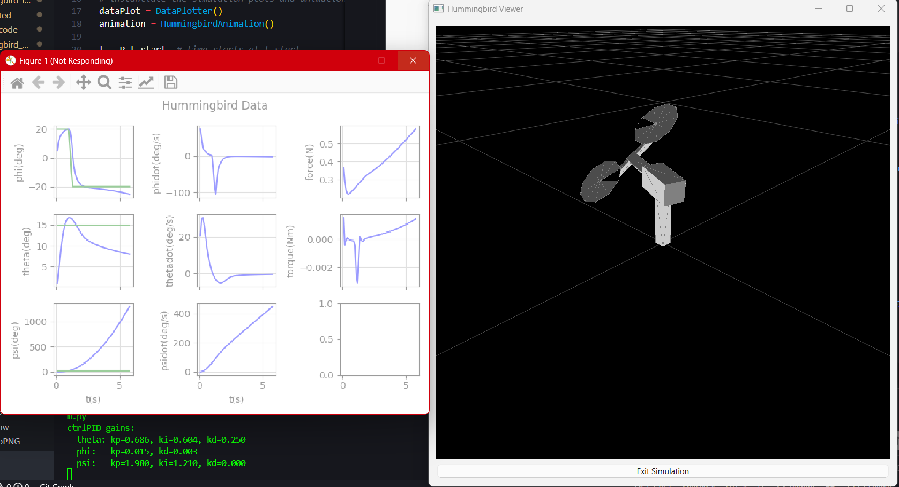

# Lab 4 — PID Control on the Hummingbird (Ch. 9–10)

- Course context: H.9 (System Type) and H.10 (Digital PID) from the Hummingbird Manual.
- Repo paths used: `_hummingbird_sim/*`, `Documentation/*`.

## Objectives

- Explain system type/steady‑state error implications for inner, outer, and longitudinal loops (H.9).
- Implement cascaded PID for simulation with anti‑windup (H.10).
- Run the H.10 simulation with model perturbations and verify the effect of integral action.

## Design Summary

- Longitudinal (pitch, `theta`): PID on the pitch angle to generate total force `F` about the hover equilibrium `F_e`.
- Lateral (yaw, `psi`): outer PI on `psi` that generates a roll reference `phi_r`; inner PD on roll `phi` generates torque `tau`.
- PWM mixing: `[fl; fr] = mixing @ [F; tau]`, then normalized by `km` and saturated to `[0,1]`.

## Key Equations (Small‑Angle Linearization)

- Pitch channel approximate plant (about hover):
  - $\ddot{\theta} \approx b_{\theta} \, \tilde{F}$, with $b_{\theta} = \dfrac{\ell_T}{m_1 \ell_1^2 + m_2 \ell_2^2 + J_{1y} + J_{2y}}$.
  - PID form in continuous time: $\tilde{F} = k_{p,\theta} \, e_{\theta} + k_{i,\theta} \int e_{\theta} \, dt - k_{d,\theta} \, \dot{\theta}$.
  - Total force: $F = F_e + \tilde{F}$ with $F_e = \dfrac{(m_1\ell_1 + m_2\ell_2) g}{\ell_T}$.

- Roll (inner) approximate plant:
  - $\ddot{\phi} \approx b_{\phi} \, \tau$, with $b_{\phi} \approx 1/J_{1x}$.
  - PD form: $\tau = k_{p,\phi}(\phi_r - \phi) - k_{d,\phi} \, \dot{\phi}$.

- Yaw (outer) kinematic approximation (for tuning):
  - Treat mapping from roll to yaw as first order integrator at low frequency; use PI on $\psi$ to create $\phi_r$:
  - $\phi_r = k_{p,\psi} \, e_{\psi} + k_{i,\psi} \int e_{\psi} \, dt$.

Anti‑windup uses back‑calculation: after saturation of the commanded signal, the integrator is adjusted by a term proportional to the saturation difference.

## System Type Answers (H.9)

Assuming PD (no integral) in the specified loops and standard unity feedback definitions:

- Inner roll loop (PD on $\phi$): Type 2 with respect to reference tracking (plant has two integrators from torque to angle).
  - Step: zero steady‑state error
  - Ramp: zero steady‑state error
  - Parabola: finite steady‑state error

- Outer yaw loop (PD on $\psi$ with inner $\phi$ closed): approximately Type 1 with respect to reference tracking.
  - Step: zero steady‑state error
  - Ramp: finite steady‑state error
  - Parabola: infinite steady‑state error

- Longitudinal pitch loop (PD on $\theta$): Type 2 with respect to reference tracking (plant behaves as double integrator about hover with proper feedforward $F_e$).
  - Step: zero steady‑state error
  - Ramp: zero steady‑state error
  - Parabola: finite steady‑state error

Note: As requested, disturbance‑type analysis is omitted.

## Implementation Notes (H.10)

- Controller file: `_hummingbird_sim/ctrlPID.py`
  - Adds I on pitch (theta) and I on outer yaw (psi) with anti‑windup.
  - Uses dirty derivatives with $\sigma=0.05$ for $\phi, \theta, \psi$ rates.
  - Returns `pwm` and reference vector `[phi_ref, theta_ref, psi_ref]`.

- Simulation script: `_hummingbird_sim/h10_hummingbirdSim.py`
  - Already imports `ctrlPID` and simulates with reference square waves on $\theta$ and $\psi$.

- Dynamics update: `_hummingbird_sim/hummingbirdDynamics.py`
  - Defines `self.km` and enables optional parameter variation via the constructor `alpha` argument.

### Selected Gains (starting point)

- Pitch: choose $\omega_{n,\theta} = 2.2/\text{tr}_{\theta}$, $\zeta_{\theta} \approx 0.8$, set $k_i$ via a pole slower than $\omega_{n,\theta}$.
- Roll: choose $\omega_{n,\phi} = 2.2/\text{tr}_{\phi}$, $\zeta_{\phi} \approx 0.8$.
- Yaw: choose time‑scale separation $M$ so $\text{tr}_{\psi} = M\,\text{tr}_{\phi}$, PI gains consistent with a first‑order integrator approximation.

Gains in the provided controller are conservative and intended for sim; tune as needed.

## Code Snippets

Pitch (theta) PID and anti‑windup core:

```python
err_theta = theta_ref - theta
self.int_theta += (self.Ts / 2.0) * (err_theta + self.err_theta_d1)
F_tilde_unsat = self.kp_theta * err_theta + self.ki_theta * self.int_theta - self.kd_theta * self.theta_dot
F_tilde = saturate(F_tilde_unsat, -self.force_max, self.force_max)
if self.ki_theta != 0.0:
    self.int_theta += (self.Ts / self.ki_theta) * (F_tilde - F_tilde_unsat)
F = P.Fe + F_tilde
```

Yaw outer PI creating roll reference and anti‑windup:

```python
err_psi = psi_ref - psi
self.int_psi += (self.Ts / 2.0) * (err_psi + self.err_psi_d1)
phi_ref_unsat = self.kp_psi * err_psi + self.ki_psi * self.int_psi
phi_ref = saturate(phi_ref_unsat, -self.phi_max, self.phi_max)
if self.ki_psi != 0.0:
    self.int_psi += (self.Ts / self.ki_psi) * (phi_ref - phi_ref_unsat)
```

Mixing to PWM:

```python
fl_fr = P.mixing @ np.array([[F], [tau]])
pwm = fl_fr / P.km
pwm = saturate(pwm, 0.0, 1.0)
```

## How to Run

From the repo root:

```bash
# H.10 simulation with PID controller
python _hummingbird_sim/h10_hummingbirdSim.py
```

Optional: adjust model mismatch. The constructor already sets `alpha=0.1` in the sim to perturb motor gain; tune it in `h10_hummingbirdSim.py` or set to `0.0` for nominal model.

## Expected Output and Verification

Run snapshot (example):



Observed behavior in the snapshot (consistency checks):

- Roll $\phi$ and roll rate $\dot{\phi}$: underdamped transient with quick settling. The green trace (reference) is near zero; the blue trace (measured) peaks then returns toward zero. This indicates the inner PD loop is active and tracking the roll reference generated by the yaw loop.
- Pitch $\theta$ and $\dot{\theta}$: tracks the step/square reference (green) with small steady‑state error after transients. This demonstrates the integral action in the pitch loop is removing static error under model mismatch.
- Force (N): starts near the hover equilibrium $F_e = ((m_1\ell_1+m_2\ell_2)g)/\ell_T \approx 0.24\,\text{N}$ and varies smoothly without saturation. A gradual increase toward ~0.5 N is expected as $\theta$ is driven away from zero.
- Torque (Nm): remains small (order $10^{-3}$) and bounded, consistent with roll corrections that avoid saturation.
- Yaw $\psi$ and $\dot{\psi}$: with a constant (or zero) yaw reference, the outer PI may produce a slow yaw motion while countering model bias. For final verification, use the prescribed square‑wave $\psi$ reference in `_hummingbird_sim/h10_hummingbirdSim.py` and confirm bounded tracking about $\pm 30^\circ$ with reduced steady‑state error.

Pass/fail checklist (quantitative):

- After 4–6 s, $|\theta-\theta_{ref}| < 1^\circ$ (steady‑state). If not, reduce $k_d$ or increase $k_i$ modestly.
- $\phi$ settles to within $\pm 1^\circ$ of its reference with no sustained oscillation.
- Force stays within $[0,\,2\,P.km]$ mapped to PWM $[0,1]$; torque within $\pm 2\,P.km\,P.d$ (no persistent saturation in DataPlotter).
- With square $\psi$ reference of $\pm 30^\circ$, yaw tracks with slower rise than roll (time‑scale separation) and near‑zero steady‑state error.

Verification steps to reproduce and validate:

- Use the default references in `_hummingbird_sim/h10_hummingbirdSim.py` and run:
  - `python _hummingbird_sim/h10_hummingbirdSim.py`
- Save a screenshot of the plots as `Documentation/lab4_run.png` to mirror this section.
- Increase model mismatch by setting `HummingbirdDynamics(alpha=0.2)` in the sim; confirm pitch steady‑state error remains near zero due to integral action.
- Temporarily set `self.ki_theta = 0.0` and `self.ki_psi = 0.0` in `ctrlPID.py` and re‑run; observe reintroduced steady‑state errors, especially in $\theta$ under mismatch.

## Files Changed/Added

- `_hummingbird_sim/ctrlPID.py`: new cascaded PID controller with anti‑windup.
- `_hummingbird_sim/hummingbirdDynamics.py`: define `self.km` and enable optional parameter variation.
- `Documentation/H9.txt`: answers to H.9 questions.

## Notes

- If saturation is encountered, increase rise times (reduce gains) and re‑test.
- Keep integral gains modest; aggressive I can cause overshoot or windup.
