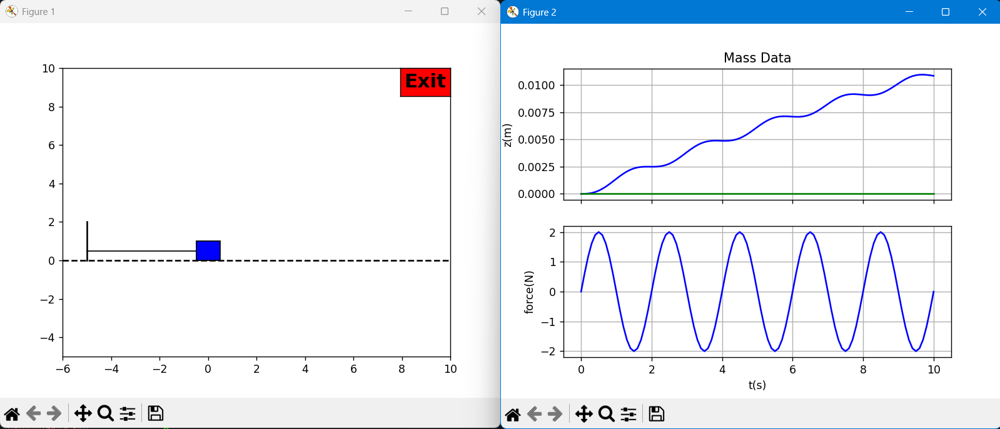

# D.5 — Mass–Spring–Damper: Transfer-function model

Given the standard equation of motion (zero initial conditions):
$$
m\,\ddot z(t)+b\,\dot z(t)+k\,z(t)=F(t).
$$

**(a) Laplace transform (time → s-domain).**
$$
m\,s^2 Z(s)+b\,s\,Z(s)+k\,Z(s)=F(s).
$$

**(b) Transfer function $G_{zF}(s)=Z(s)/F(s)$.**
$$
G_{zF}(s)=\frac{1}{m s^2+b s+k}
=\frac{\tfrac{1}{m}}{s^2+\tfrac{b}{m}s+\tfrac{k}{m}}.
$$

**(c) Block diagram (text description).**
- Single block $G_{zF}(s)=1/(m s^2+b s+k)$ from input $F$ to output $z$.
- Equivalent signal flow:
  - Sum node (net force): $F - b\,\dot z - k\,z$.
  - Gain $1/m$ → acceleration $\ddot z$.
  - Two cascaded integrators $1/s$ → $\dot z$ then $z$.
  - Feedback taps: $k$ from $z$ and $b$ from $\dot z$ into the sum node.

---

# D.6 — Mass–Spring–Damper: State-space model

Let
$$
x=\begin{bmatrix}z\\ \dot z\end{bmatrix},\quad
u=F,\quad
y=z.
$$

From $m\,\ddot z+b\,\dot z+k\,z=F$:
$$
\dot x=
\begin{bmatrix}
\dot z\\ \ddot z
\end{bmatrix}
=
\underbrace{\begin{bmatrix}
0 & 1\\[2pt]
-\tfrac{k}{m} & -\tfrac{b}{m}
\end{bmatrix}}_{A}x
+
\underbrace{\begin{bmatrix}
0\\[2pt]\tfrac{1}{m}
\end{bmatrix}}_{B}u,
\qquad
y=\underbrace{\begin{bmatrix}1\;0\end{bmatrix}}_{C}x+\underbrace{[0]}_{D}u.
$$

# HW3 Testing — D Section (Spring Mass)
## 1. massDynamics.py
### Run massDynamics.py
Expect all Tests (1-10) to pass
```bash
C:/Users/consa/Downloads/Programming/Robotics_Controls/.venv/Scripts/python.exe c:/Users/consa/Downloads/Programming/Robotics_Controls/_D_mass/python/testDynamics.py
```

### Output
```fortran
Test  1: PASS
Test  2: PASS
Test  3: PASS
Test  4: PASS
Test  5: PASS
Test  6: PASS
Test  7: PASS
Test  8: PASS
Test  9: PASS
Test 10: PASS

Excellent work!! The f(x,u) function from your dynamics file has passed all of the tests!
```

## 2. runMassAnimation.py

### Run runMassAnimation.py
```bash
C:/Users/consa/Downloads/Programming/Robotics_Controls/.venv/Scripts/python.exe c:/Users/consa/Downloads/Programming/Robotics_Controls/_D_mass/python/runMassAnimation.py
```
### Output
Expect smooth oscillatory position response to the sinusoidal force 


```fortran
D.5 transfer function Z/F: num = [1.]  den = [5.  0.5 3. ]
D.6 state space:
A=
 [[ 0.   1. ]
 [-0.6 -0.1]]
B=
 [[0. ]
 [0.2]]
C=
 [[1. 0.]]
D=
 [[0.]]
Close the figure window to end.
```


